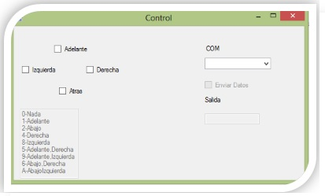
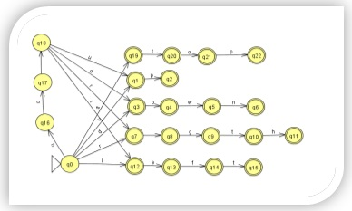
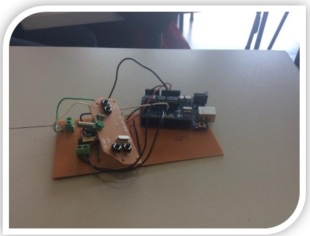
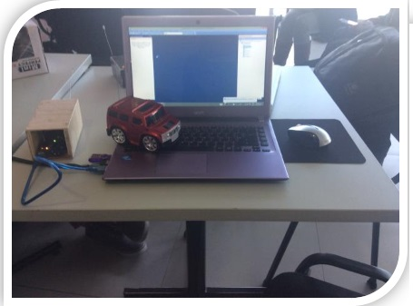

# Smar Car with C sharp

Develop a Artificial Intelligence for move a car inside of graph, and find the best route using A* Algorithm

Hoy en día una de las metas de la ciencia, es la de usar vehículos no tripulados, para realizar tareas específicas donde al hombre se le dificulta acceder, y que a su vez lo haga de una manera inteligente y óptima, para realizar tales vehículos, el hombre acude a la inteligencia artificial y a la teoría computacional por mencionar algunas ramas de la computación. Sabiendo que este tipo de inventos son complejos, se ha delimitado el proyecto a solo las acciones básicas de estos, las cuales son la de poder controlar el vehículo, que en este caso es un carro, de una manera diferente, dejando a un lado su control habitual. La otra meta es que logre simular la solución de un grafo usando herramientas de la inteligencia artificial.

El proyecto consiste en cambiar el control remoto de un carro de juguete, sustituirlo y poder controlarlo por medio de la computadora, utilizando diferentes instrucciones, las cuales serán interpretadas y ejecutadas por el vehículo. Otra acción del carro en el proyecto, es la de lograr solucionar un grafo por medio de algoritmos de búsqueda ya implementados en la inteligencia artificial, como lo son: el algoritmo de primero en anchura y el algoritmo de heurística A*.

# Desarrollo de proyecto

 En un principio se contempló la utilización de relevadores en el circuito anteriormente mencionado, pero después de investigar la hoja de datos del circuito integrado que contiene el control remoto, nos informamos que el rango del voltaje aceptado por el integrado es de 3 - 6 volts. Esto nos benefició mucho, ya que la utilización de reveladores ya no sería necesaria, debido a que los 5 volts que salen directamente de la computadora son suficientes para darle operatividad al control y poder mandar las señales necesarias, lo que significó utilizar el circuito integrado del control remoto del carro con nuestro circuito.

Otro punto importante a mencionar es que la forma en que se comunicaría la computadora con el carro era por el puerto paralelo. Para ello se compró un cable adaptador de USB a paralelo pero nos encontramos con el gran inconveniente de que el controlador del adaptador sirve exclusivamente para  ser utilizado con impresoras de puerto paralelo. Después de una búsqueda exhaustiva por encontrar un controlador que simulara literalmente un puerto paralelo y con resultados no gratos, se optó por la utilización de otro medio de comunicación utilizando el puerto serial con un Arduino UNO.

Se usó el Arduino (plataforma de hardware libre, basada en una placa con un micro controlador y un entorno de desarrollo), para conectarse a la computadora mediante el puerto serial (COM), y conseguir de este modo la comunicación entre la terminal (computadora) y el arduino.

Así mismo, se empezó a diseñar y programar una interfaz en el lenguaje C# utilizando la IDE Visual Studio. De esta forma se mandarán los datos al puerto serial desde la interfaz. A su vez se cargó un programa al arduino el cual activará o desactivaría ciertos pines, los cuales enviarían la información al circuito intermediario entre el carro y el Arduino. En un principio la interfaz solo estaba programada para que con las flechas del teclado se mandaran las señales al carro y poder probar el funcionamiento correcto de este.

Posteriormente se continuó con la modificación del control remoto, se probó cada terminal del circuito, para encontrar su función correspondiente (arriba, abajo, derecha, izquierda). Una vez identificada cada función, se prosiguió a conectar un cable a cada entrada correspondiente. Con esto comprobamos que las entradas estaban invertidas, si le llegaba un 1 lógico el motor correspondiente no se activaba, pero si era un 0 lógico si se activa. Por ende se decidió a utilizar una compuerta de negación (integrado 7404)) para invertir las entradas.

Teniendo ya las entradas funcionando se continuó con la integración de la interfaz con el carro. Se conectó el arduino al circuito intermediario, teniendo comunicación entre computadora y el control remoto. Utilizando la interfaz comprobamos que ya era operable el control remoto con la computadora, utilizando las teclas de dirección para accionar los movimientos del coche.

  

### Autómata finito no determinista (AFND)
Posteriormente se prosiguió al desarrollar un intérprete para la interacción del coche y la computadora,  para ello se utilizó un autómata finito no determinista (AFND), los cuales se definen como modelos matemáticos que permiten representar situaciones complejas de una manera más directa, pero a la vez más difícil de predecir, debido a que pueden estar en varios estados de manera simultánea. De manera más formal un AFND se define como un modelo matemático definido por la quíntupla M = (Q, ∑, f, q0, F) en el que:

* 	Q es un conjunto finito llamado conjunto de estados.
* 	 ∑ es un conjunto finito de símbolos, llamado alfabeto de entrada.
* 	f es una aplicación llamada función de transición definida como:
                                           F: (Q x ∑) x Q    	
* 	q0 es un elemento o estado de Q, llamado estado inicial.
* 	 F es un subconjunto de Q, llamado conjunto de estados finales.
 
La representación de este autómata de manera gráfica se muestra en la figura siguiente.

  

En la imagen se puede observar la cantidad de estados que utilizaron, que en total fueron 23, los cuales nos ayudaron a poder validar las cadenas.

Esté autómata  nos permitió validar las sentencias que la computadora aceptaría para poder mover el carrito, dichas sentencias son: up, down, right, left, no up, no down, no left, no right, stop. 
Cabe mencionar que se utilizaron las palabras en inglés para evitar que se ingresen palabras muy grandes como adelante, atrás, derecha o izquierda, así como evitar confusiones al momento de ingresarlas y que el intérprete fuera un tanto más amigable en cuanto uso al momento de utilizarlo.

 
### Algoritmos de busqueda
En la parte de la integración de inteligencia artificial se usaron los algoritmos de primero en anchura, dijkstra y de heurística A*, las cuales representan algoritmos de búsqueda no informada e informada. Estas clases de algoritmos de búsqueda son los pilares de la inteligencia artificial, para obtener resultados ya sean óptimos o mejores, dependiendo de lo que se desea encontrar. En este caso utilizamos el algoritmo de dijkstra y A* en conjunto para lograr encontrar el camino más corto con la heurística.
El programa desarrollado será capaz de resolver con cualquier grafo que sea ingresado por el usuario, utilizando dos métodos: el menor número de saltos y búsqueda de menor costo.

A continuación se explicará la manera en que estos trabajan:

* Algoritmo Búsqueda en anchura.
La búsqueda en anchura es otro procedimiento para visitar sistemáticamente todos los vértices de un grafo. Es adecuado especialmente para resolver problemas de optimización, en los que se deba elegir la mejor solución entre varias posibles. Se comienza en un vértice v (la raíz) que es el primer vértice activo. En el siguiente paso se etiquetan como visitados todos los vecinos del vértice activo que no han sido etiquetados. Se continúa etiquetando todos los vecinos de los hijos de v (que no hayan sido visitados aún).
En este proceso nunca se visita un vértice dos veces por lo que se construye un grafo sin ciclos, que será un árbol generador de la componente conexa que contiene a v.
Sea G (V, E) un grafo conexo y v un vértice de V. El algoritmo de búsqueda en anchura puede detallarse así:
1.	Designamos a v como vértice activo y como raíz del árbol generador T que se     construirá. Se le asigna a v la etiqueta 0.
2.	Sea i=0 y S= {v}.
3.	Hallar el conjunto M de todos los vértices no etiquetados que son adyacentes a algún vértice de S.
4.	Si M es vacío el algoritmo termina. En caso contrario, se etiquetan todos los vértices de M con i+1, se añaden a T las aristas entre cada vértice de S y su vecino en M y se hace S=M.
5.	i=i+1 y volver al paso 3. Al terminar el proceso se habrá construido un árbol generador del grafo inicial. En caso de G no ser conexo, habría que modificar el algoritmo para encontrar un árbol generador de cada componente conexa de G.

Con este algoritmo se obtiene un árbol en donde predomina la anchura, es decir, se obtiene mayor cantidad de hijos por nodo, donde su número de niveles es muy bajo. Por esto es que se decidió utilizar este algoritmo para poder obtener una solución al grafo basándonos en el menor número de saltos.

* Algoritmo Dijkstra:
El algoritmo de dijkstra determina la ruta más corta desde un nodo origen hacia los demás nodos para ello es requerido como entrada un grafo cuyas aristas posean pesos. 
Primero marcamos todos los vértices como no utilizados. El algoritmo parte de un vértice origen que será ingresado, a partir de ese vértice evaluaremos sus adyacentes, como dijkstra usa una técnica greedy - La técnica greedy utiliza el principio de que para que un camino sea óptimo, todos los caminos que contiene también deben ser óptimos- entre todos los vértices adyacentes, buscamos el que esté más cerca de nuestro punto origen, lo tomamos como punto intermedio y vemos si podemos llegar más rápido a través de este vértice a los demás. Después escogemos al siguiente más cercano (con las distancias ya actualizadas) y repetimos el proceso. Esto lo hacemos hasta que el vértice no utilizado más cercano sea nuestro destino. Al proceso de actualizar las distancias tomando como punto intermedio al nuevo vértice se le conoce como relajación.

1.	método Dijkstra (Grafo, origen):
2.	creamos una cola de prioridad Q
3.	agregamos origen a la cola de prioridad Q
4.	mientras Q no este vacío:
i.	sacamos un elemento de la cola Q llamado u
ii.	si u ya fue visitado continuo sacando elementos de Q    
iii.	marcamos como visitado u
iv.	para cada vértice v adyacente a u en el Grafo:
1.	sea w el peso entre vértices ( u , v )  
2.	si v no ha sido visitado:
3.	Relajación( u , v , w )

5.	método Relajación( actual , adyacente , peso ):
6.	si distancia[ actual ] + peso < distancia[ adyacente ]
i.	distancia[ adyacente ] = distancia[ actual ] + peso
ii.	agregamos adyacente a la cola de prioridad Q

Este algoritmo se emplea para poder utilizar de una manera más eficaz el algoritmo A*. Como A* utiliza una función g(n), la cual es la distancia más corta para del nodo origen al nodo actual. Para poder obtener este valor se propuso la implementación del algoritmo dijkstra y de esta manera calcular la distancia mínima de cada nodo.

* Algoritmo A*
El algoritmo A* es un algoritmo de búsqueda que puede ser empleado para el cálculo de caminos mínimos en un grafo. Se va a tratar de un algoritmo heurístico, ya que una de sus principales características hará uso de una función de evaluación heurística f(n), mediante la cual etiquetará los diferentes nodos del grafo y que servirá para determinar la probabilidad de dichos nodos de pertenecer al camino óptimo.
Esta función de evaluación etiquetará los nodos de la red está compuesta a su vez por otras dos funciones. Una de ellas indicará la distancia actual desde el nodo origen hasta el nodo a etiquetar, g(n), y la otra expresará la distancia estimada desde este nodo a etiquetar hasta el nodo destino hasta el que se pretende encontrar un camino mínimo, h(n).

1.	función A*(inicio, meta)
2.	cerrada := la cadena vacía
3.	abierta := {inicio}
4.	padre := el mapa vacío
     g_valor[inicio] := 0
     f_valor[inicio] := g_valor[inicio] + heuristica_costo_estimado(inicio, meta)

5.	mientras abierta no este vacía
          actual := el nodo en abierta con el f_valor[] menor
          si actual = meta
               return camino(padre, meta)
          remover actual de abierta
          añadir actual a cerrada
          para cada adyacente en la matriz de adyacencia (actual)
               si adyacente en cerrada
                    continua
               tentativa_g_valor := g_valor[actual] +  distancia_entre(actual, adyacente)
a.	si adyacente no está en cerrada o tentativa_g_valor < g_valor[adyacente] 
i.	padre[adyacente] := actual
                    g_valor[adyacente] := tentativa_g_valor
                    si adyacente no está en abierta
                         añadir adyacente a abierta
6.	regresar fallo
 
función camino(padre, actual)
7.	camino_total := [actual]
8.	mientras actual este en padre:
9.	actual := came_from[actual]
10.	camino_total.append(actual)
11.	regresa camino_total

Con este algoritmo se puede obtener una búsqueda de menor costo utilizando heurística, y así obtener un resultado correcto para la solución de algún grafo dado.

### Resultados
Se logró controlar correctamente el coche mediante la interfaz cargada en la computadora, dicho control implica las dos variantes de control, vía cadenas y mediante el uso de las teclas de navegación.
Se completó la tarea de procesar correctamente un grafo introducido por el usuario, para que con ello se pueda encontrar el camino más óptimo según el algoritmo elegido por el mismo usuario. Al obtener dicha solución del grafo, se hizo una simulación de recorrido de ésta mediante el movimiento del coche

  

  

### Development
#### Building for source
### Docker
#### Kubernetes + Google Cloud
### Todos
License
----
MIT
**Free Software**
